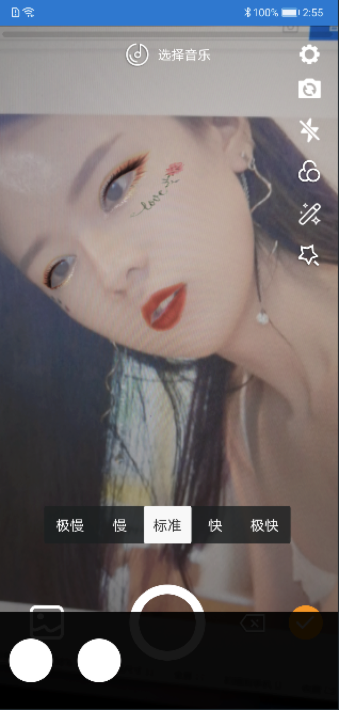
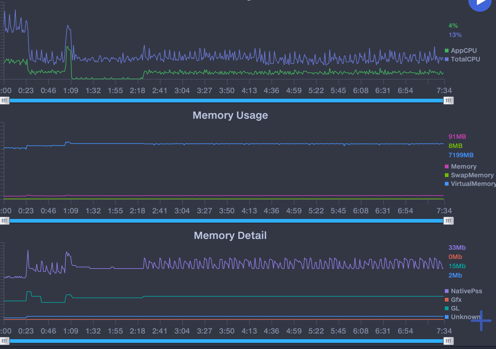

# trinity


[](https://android-arsenal.com/details/1/8010)
[](https://travis-ci.org/wlanjie/trinity/)
[](https://bintray.com/wlanjie/maven/trinity/0.2.9.1/link)

[](https://opensource.org/licenses/Apache-2.0)

**trinity是一个开源的拍摄和短视频处理工具，用kotlin和c++编写，实现了大部分短视频编辑软件热门功能。**

## Apk 下载
- 请在Actions中每次commit ci编译的结果中下载


## QQ交流群
```
125218305
```
## 联系我
- email: wlanjie888@gmail.com

## git commit 规范
- 遵循 [git cz](https://github.com/commitizen/cz-cli)

## 代码规范
- kotlin缩进使用2空格缩进
- c++代码遵循[google c++风格指南](https://zh-google-styleguide.readthedocs.io/en/latest/google-cpp-styleguide/)

## 系统版本

支持Android 4.3及以上版本

## 开发环境
- Android Studio 3.5
- NDK r20
- kotlin 1.3.41

## 使用的开源库
- fdk-aac
- ffmpeg 3.4
- libx264
- xlogger
- mnnkit

## 功能
<table>
  <tr>
      <td rowspan="16">视频拍摄<br/>
  </tr>
  <tr>
      <td>功能说明</td>
      <td>是否支持</td>
  </tr>
  <tr>
      <td>多段录制</td>
      <td align="center">√</td>
  </tr>
  <tr>
      <td>自定义时长</td>
      <td align="center">√</td>
  </tr>
  <tr>
      <td>自定义相机配置</td>
      <td align="center">√</td>
  </tr>  
  <tr>
      <td>摄像头切换</td>
      <td align="center">√</td>
  </tr>
  <tr>
      <td>闪光灯</td>
      <td align="center">√</td>
  </tr>
  <tr>
      <td>焦距调节</td>
      <td align="center">√</td>
  </tr>
  <tr>
      <td>手动对焦</td>
      <td align="center">√</td>
  </tr>
  <tr>
      <td>静音</td>
      <td align="center">√</td>
  </tr>
  <tr>
      <td>美颜</td>
      <td align="center">x</td>
  </tr>
  <tr>
      <td>磨皮</td>
      <td align="center">√</td>
  </tr>
  <tr>
      <td>自定义分辨率及码率</td>
      <td align="center">√</td>
  </tr>
  <tr>
      <td>录制背景音</td>
      <td align="center">√</td>
  </tr>
  <tr>
      <td>录制变速</td>
      <td align="center">√</td>
  </tr>
  <tr>
      <td>软硬编码</td>
      <td align="center">√</td>
  </tr>
	<tr>
      <td rowspan="8">视频编辑<br/>
  </tr>
  <tr>
      <td>多段编辑</td>
      <td align="center">√</td>
  </tr>
  <tr>
      <td>替换片段</td>
      <td align="center">√</td>
  </tr>
  <tr>
      <td>设置片段时间</td>
      <td align="center">√</td>
  </tr>  
  <tr>
      <td>背景音乐</td>
      <td align="center">√</td>
  </tr>
  <tr>
      <td>硬解码</td>
      <td align="center">√</td>
  </tr>
  <tr>
      <td>软解码</td>
      <td align="center">√</td>
  </tr>
  <tr>
      <td>图片视频混合</td>
      <td align="center">√</td>
  </tr>
  <tr>
      <td rowspan="16">特效<br/>
  </tr>
  <tr>
      <td>滤镜</td>
      <td align="center">√</td>
  </tr>
  <tr>
	    <td>闪白</td>
      <td align="center">√</td>
  </tr>
  <tr>
      <td>两分屏</td>
      <td align="center">√</td>
  </tr>  
  <tr>
      <td>三分屏</td>
      <td align="center">√</td>
  </tr>
  <tr>
      <td>四分屏</td>
      <td align="center">√</td>
  </tr>
  <tr>
      <td>六分屏</td>
      <td align="center">√</td>
  </tr>
  <tr>
      <td>九分屏</td>
      <td align="center">√</td>
  </tr>
  <tr>
      <td>模糊分屏</td>
      <td align="center">√</td>
  </tr>
  <tr>
      <td>高斯模糊</td>
      <td align="center">√</td>
  </tr>
  <tr>
      <td>灵魂出窍</td>
      <td align="center">√</td>
  </tr>
  <tr>
      <td>抖动</td>
      <td align="center">√</td>
  </tr>
  <tr>
      <td>毛刺</td>
      <td align="center">√</td>
  </tr>
  <tr>
    <td>70s</td>
    <td align="center">√</td>
  </tr>
  <tr>
    <td>倒计时</td>
    <td align="center">√</td>
  </tr>
  <tr>
    <td>爱心光斑</td>
    <td align="center">√</td>
  </tr>
  <tr>
    <td rowspan="6">人脸识别<br/>
  </tr>
  <tr>
    <td>玫瑰眼妆</td>
    <td align="center">√</td>
  </tr>
  <tr>
    <td>王妃</td>
    <td align="center">√</td>
  </tr>
  <tr>
    <td>贴纸妆</td>
    <td align="center">√</td>
  </tr>
    <tr>
    <td>飘落小猪</td>
    <td align="center">√</td>
  </tr>
  <tr>
    <td>猫头</td>
    <td align="center">√</td>
  </tr>
</table>

## 人脸特效
 

## 特效调试
项目中使用xcode调试特效效果, 使用前需要安装glfw  
```
brew install glfw
```
然后使用xcode打开```library/src/main/cpp/opengl.xcodeproj```即可  
切换效果调用代码
```
image_process.OnAction("param/blurScreen", 0);
```

## 自动化测试
- 自动化测试使用[uiautomator2](https://github.com/openatx/uiautomator2)具体使用请参考文档
使用方式如下:  
``` python
cd trinity
python trinity.py
```
然后使用
```
adb devices
```
在终端输入设备名即可

## 性能


## 使用

<font color=red>注意: SDK中不做权限判断,使用时需要由调用方申请好权限, SDK中涉及到的时间均为毫秒</font>

### 添加jcenter依赖
``` gradle
dependencies {
    implementation 'com.github.wlanjie:trinity:0.2.9.1'
}
```

### 权限要求
``` xml
<uses-permission android:name="android.permission.CAMERA" />
<uses-permission android:name="android.permission.RECORD_AUDIO" />
<uses-permission android:name="android.permission.WRITE_EXTERNAL_STORAGE" />
<uses-permission android:name="android.permission.READ_EXTERNAL_STORAGE" />
```

## 录制

### 配置参数
- 创建录制预览view
``` kotlin
val preview = findViewById<TrinityPreviewView>(R.id.preview)
```

- 创建录制接口实例
``` kotlin
mRecord = TrinityRecord(preview)
```

- 销毁录制接口实例
``` kotlin
mRecord.release()
```

### 回调设置
- 设置视频渲染回调
``` kotlin
mRecord.setOnRenderListener(this)
```

- 设置录制进度回调
``` kotlin
mRecord.setOnRecordingListener(this)
```

- 设置相机回调
``` kotlin
mRecord.setCameraCallback(this)
```

### 开启预览
- 开始预览
``` kotlin
mRecord.startPreview()
```

- 结束预览
``` kotlin
mRecord.stopPreview()
```

- 设置预览类型
``` kotlin
// 设置显示类型
// 包含裁剪显示, 原比例上下留黑显示
mRecord.setFrame(mFrame)
```

### 录制控制/管理
- 切换摄像头
``` kotlin
mRecord.switchCamera()
```

- 获取当前摄像头
``` kotlin
// 返回当前摄像头id
val facing = mRecord.getCameraFacing()
```

- 开关闪光灯
``` kotlin
mRecord.flash(mFlash)
```
- 设置zoom
``` kotlin
// 设置焦距缩放, 0-100 100为最大缩放
mRecord.setZoom(0)
```
- 设置曝光度
``` kotlin
// 设置相机曝光度, 100为最大曝光
mRecord.setExposureCompensation(0)
```
- 手动对焦
``` kotlin
// 设置手动对焦, 参数为x和y
mRecord.focus(mPointF)
```
- 设置录制视频的角度
``` kotlin
/**
 * @param rotation 旋转角度包含 0 90 180 270
 */
mRecord.setRecordRotation(0)
```
- 设置静音录制
``` kotlin
mRecord.setMute(false)
```
- 倍速录制
``` kotlin
/**
 * @param speed 速度包含 0.25 0.5 1.0 2.0 4.0倍速
 */
mRecord.setSpeed(mSpeed)
```

### 开始录制

- 开始录制一段视频
``` kotlin
/**
 * 开始录制一段视频
 * @param path 录制的视频保存的地址
 * @param width 录制视频的宽, SDK中会做16倍整数的运算, 可能最终输出视频的宽和设置进去的不一致
 * @param height 录制视频的高, SDK中会做16倍整数的运算, 可能最终输出视频的宽和设置进去的不一致
 * @param videoBitRate 视频输出的码率, 如果设置的是2000, 则为2M, 最终输出的和设置的可能有差别
 * @param frameRate 视频输出的帧率
 * @param useHardWareEncode 是否使用硬编码, 如果设置为true, 而硬编码不支持,则自动切换到软编码
 * @param audioSampleRate 音频的采样率
 * @param audioChannel 音频的声道数
 * @param audioBitRate 音频的码率
 * @param duration 需要录制多少时间
 * @return Int ErrorCode.SUCCESS 为成功,其它为失败
 * @throws InitRecorderFailException
 */
mRecord.startRecording("/sdcard/a.mp4",
                      720,
                      1280,
                      2000, // 2M码率
                      30,
                      false,
                      44100,
                      1, // 单声道
                      128, // 128K 码率
                      Int.MAX_VALUE)
```

- 结束录制
``` kotlin
mRecord.stopRecording()
```

### 视频编辑

#### 初始化

- 创建编辑器实例
``` kotlin
mVideoEditor = TrinityCore.createEditor(this)
```

- 设置预览画面
``` kotlin
val surfaceView = findViewById<SurfaceView>(R.id.surface_view)
mVideoEditor.setSurfaceView(surfaceView)
```

#### 导入视频
- 添加一个片段
``` kotlin
val clip = MediaClip(file.absolutePath)
mVideoEditor.insertClip(clip)
```
- 根据下标添加片段
``` kotlin
val clip = MediaClip(file.absolutePath)
mVideoEditor.insertClip(0, clip)
```
- 删除一个片段
``` kotlin
/**
 * 根据下标删除一个片段
 */
mVideoEditor.removeClip(index)
```
- 获取片段的数量
``` kotlin
val count = mVideoEditor.getClipsCount()
```
- 根据下标获取一个片段
``` kotlin
/**
 * 如果片段不存在, 返回一个null
 */
val clip = mVideoEditor.getClip(index)
```
- 根据下标替换一个片段
``` kotlin
mVideoEditor.replaceClip(index, clip)
```
- 获取所有片段
``` kotlin
/**
 * 返回所有片段的集合
 */
val clips = mVideoEditor.getVideoClips()
```
- 获取所有片段的时间总长
``` kotlin
val duration = mVideoEditor.getVideoDuration()
```
- 获取当前播放片段的进度
``` kotlin
val current = mVideoEditor.getCurrentPosition()
```
- 获取指定片段的开始和结束时间
``` kotlin
val timeRange = mVideoEditor.getClipTimeRange(index)
```
- 根据时间查找片段的下标
``` kotlin
val index = mVideoEditor.getClipIndex(time)
```
#### 背景音乐
- 添加背景音乐
``` kotlin
/**
 * @param config 背景音乐json内容
 * 具体json内容如下:
 * {
 *    "path": "/sdcard/trinity.mp3",
 *    "startTime": 0,
 *    "endTime": 2000
 * }
 * json 参数解释:
 * path: 音乐的本地地址
 * startTime: 这个音乐的开始时间
 * endTime: 这个音乐的结束时间 2000代表这个音乐只播放2秒钟
 */
val actionId = mVideoEditor.addMusic(config)
```

- 更新背景音乐
``` kotlin
/**
 * @param config 背景音乐json内容
 * 具体json内容如下:
 * {
 *    "path": "/sdcard/trinity.mp3",
 *    "startTime": 2000,
 *    "endTime": 4000
 * }
 * json 参数解释:
 * path: 音乐的本地地址
 * startTime: 这个音乐的开始时间
 * endTime: 这个音乐的结束时间 4000代表这个音乐从开始时间到结束时间播放2秒钟
 */
val actionId = mVideoEditor.addMusic(config)
```

- 删除背景音乐
``` kotlin
/**
* 删除背景音乐
* @param actionId 必须为添加背景音乐时返回的actionId
*/
mVideoEditor.deleteMusic(actionId)
```

#### 添加特效
- 添加普通滤镜
``` kotlin
/**
* 添加滤镜
* 如: content.json的绝对路径为 /sdcard/Android/com.trinity.sample/cache/filters/config.json
* 传入的路径只需要 /sdcard/Android/com.trinity.sample/cache/filters 即可
* 如果当前路径不包含config.json则添加失败
* 具体json内容如下:
* {
*  "type": 0,
*  "intensity": 1.0,
*  "lut": "lut_124/lut_124.png"
* }
*
* json 参数解释:
* type: 保留字段, 目前暂无作用
* intensity: 滤镜透明度, 0.0时和摄像头采集的无差别
* lut: 滤镜颜色表的地址, 必须为本地地址, 而且为相对路径
*      sdk内部会进行路径拼接
* @param configPath 滤镜config.json的父目录
* @return 返回当前滤镜的唯一id
*/
val actionId = mVideoEditor.addFilter(config)
```
- 更新滤镜
``` kotlin
/**
* 更新滤镜
* @param configPath config.json的路径, 目前对称addFilter说明
* @param startTime 滤镜的开始时间
* @param endTime 滤镜的结束时间
* @param actionId 需要更新哪个滤镜, 必须为addFilter返回的actionId
*/
mVideoEditor.updateFilter(config, 0, 2000, actionId)
```

- 删除滤镜
``` kotlin
 /**
   * 删除滤镜
   * @param actionId 需要删除哪个滤镜, 必须为addFilter时返回的actionId
   */
mVideoEditor.deleteFilter(actionId)   
```
- 添加抖音特效
``` kotlin
/**
* 添加特效
* 如: content.json的绝对路径为 /sdcard/Android/com.trinity.sample/cache/effects/config.json
* 传入的路径只需要 /sdcard/Android/com.trinity.sample/cache/effects 即可
* 如果当前路径不包含config.json则添加失败
* @param configPath 滤镜config.json的父目录
* @return 返回当前特效的唯一id
*/
val actionId = mVideoEditor.addAction(configPath)
```

- 更新抖音特效
``` kotlin
/**
* 更新指定特效
* @param startTime 特效的开始时间
* @param endTime 特效的结束时间
* @param actionId 需要更新哪个特效, 必须为addAction返回的actionId
*/
mVideoEditor.updateAction(0, 2000, actionId)
```

- 删除抖音特效
``` kotlin
/**
* 删除一个特效
* @param actionId 需要删除哪个特效, 必须为addAction返回的actionId
*/
mVideoEditor.deleteAction(actionId)
```

#### 开始预览
- 准备
``` kotlin
mVideoEditor.prepare()
```

- 播放
``` kotlin
/**
 * @param repeat 是否循环播放
 */
mVideoEditor.play(repeat)
```
- 暂停
``` kotlin
mVideoEditor.pause()
```
- 继续播放
``` kotlin
mVideoEditor.resume()
```
- 停止播放
``` kotlin
mVideoEditor.stop()
```

#### 释放资源
``` kotlin
mVideoEditor.destroy()
```

### 导出视频
- 创建导出实例
``` kotlin
val export = TrinityCore.createExport(this)
```
- 开始导出
``` kotlin
/**
  * 开始导出
  * @param info 导出实体类
  * @param l 导出回调 包含成功 失败 和进度回调
  * @return Int ErrorCode.SUCCESS 为成功,其它为失败
  */
// 创建实体类, 必须传入视频输出地址  
val exportVideoInfo = VideoExportInfo("/sdcard/export.mp4")
// 使用硬解码
exportVideoInfo.mediaCodecDecode = true
// 使用硬编码
exportVideoInfo.mediaCodecEncode = true  
// 视频宽
exportVideoInfo.width = 544
// 视频高
exportVideoInfo.height = 960
// 帧率
exportVideoInfo.frameRate = 25
// 视频码率 2M
exportVideoInfo.videoBitRate = 2000
// 采样率
exportVideoInfo.sampleRate = 44100
// 声道数
exportVideoInfo.channelCount = 1
// 音频码率 128K
exportVideoInfo.audioBitRate = 128
export.export(exportVideoInfo, this)
```
- 取消
``` kotlin
export.cancel()
```
- 释放
``` kotlin
export.release()
```

```
Copyright 2019 Trinity, Inc.

Licensed under the Apache License, Version 2.0 (the "License");
you may not use this file except in compliance with the License.
You may obtain a copy of the License at

   http://www.apache.org/licenses/LICENSE-2.0

Unless required by applicable law or agreed to in writing, software
distributed under the License is distributed on an "AS IS" BASIS,
WITHOUT WARRANTIES OR CONDITIONS OF ANY KIND, either express or implied.
See the License for the specific language governing permissions and
limitations under the License.
```
